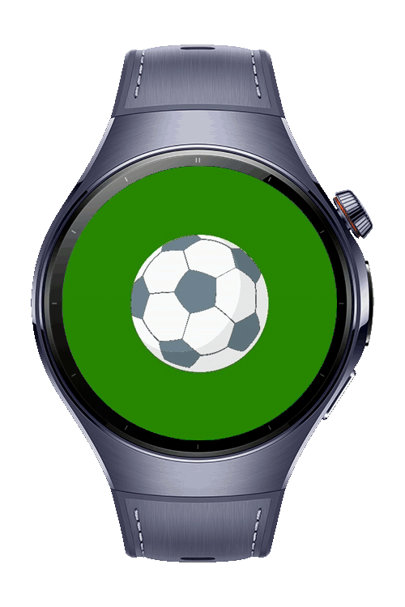
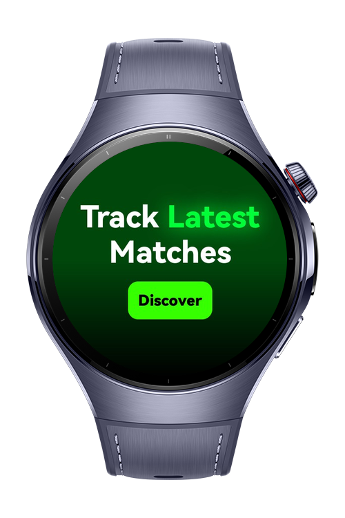
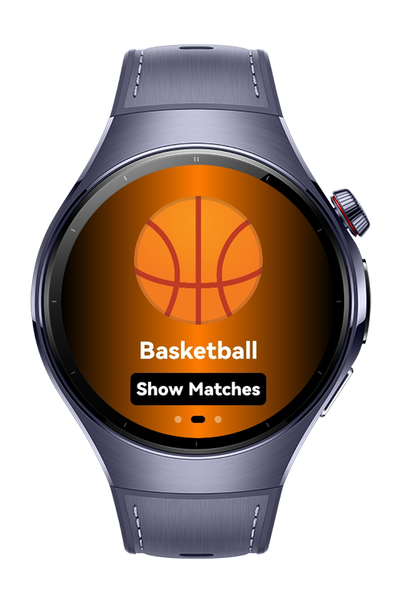
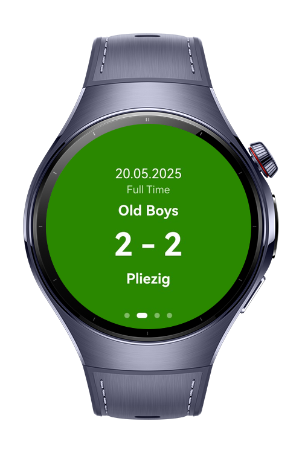

> **Note:** To access all shared projects, get information about environment setup, and view other guides, please visit [Explore-In-HMOS-Wearable Index](https://github.com/Explore-In-HMOS-Wearable/hmos-index).

# Match Results Tracker Sample App

This solution is intended for ArkUI design example.
The application contains varies usages of components.
Application is sample Match Results Tracking app for sport lovers. It has 3 different sport category to follow:
Football, Basketball and Volleyball.

# Preview

<div>
  
  
  
  
</div>

# Use Cases

- In three different categories users can follow match results

# Tech Stack

- **Languages**: ArkTS, Typescript
- **Frameworks**: HarmonyOS SDK 5.1.0(18)
- **Tools**: DevEco Studio Vers 5.1.0.842
- **Libraries**:
    - `@kit.AbilityKit`
    - `@kit.ArkUI`
    - `@kit.PerformanceAnalysisKit`
    - `@kit.CoreFileKit`

# Directory Structure

  ```
entry/src/main/ets/
|---common
|---|---constants
|---|----enums
|---pages
|---|---matches
|---|---|---MatchesPage
|---|---splash
|---|---|---SplashPage
|---|---sports
|---|---|---SportsPage
|---|---Index
|---viewmodels
|---|---MatchesViewModel
|---|---SportsViewModel
|---views
|---|---index
|---|---|---AnimatedText
|---entryability
|---|---EntryAbility
|---entrybackupability
|---|---EntryBackupAbility
  ```

# Constraints and Restrictions

## Supported Devices

- Huawei Watch 5

# LICENSE

**Match Results Tracker** is distributed under the terms of the MIT License.
See the [LICENSE](/LICENSE) for more information.