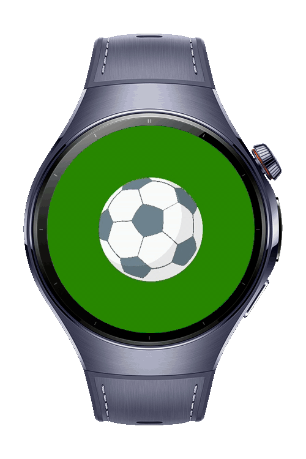
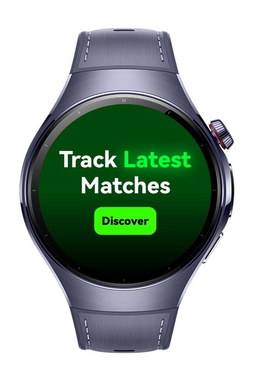
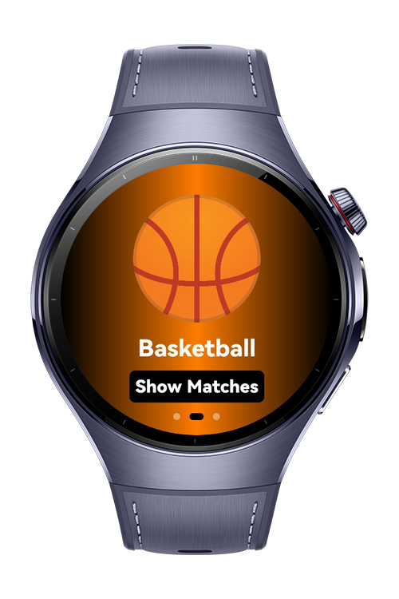
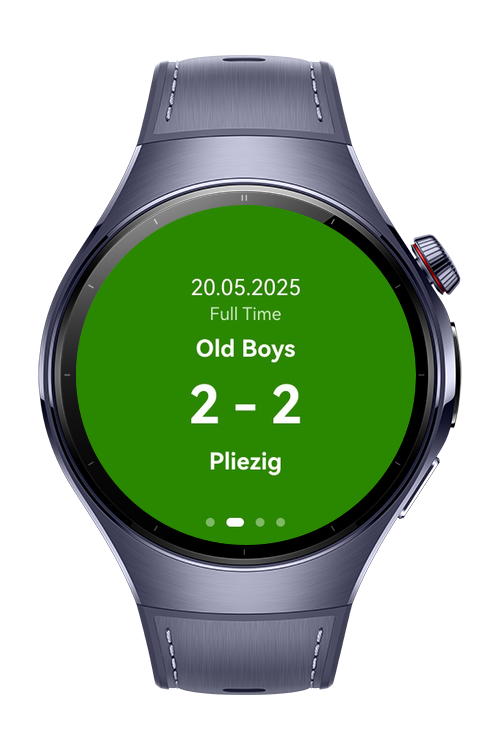

# Match Results Tracker Sample App

This solution is intended for ArkUI design example.
The application contains varies usages of components.
Application is sample Match Results Tracking app for sport lovers. It has 3 different sport category to follow:
Football, Basketball and Volleyball.

# Preview

<div>
  
  
  
  
</div>

# Use Cases

- In three different categories users can follow match results
- Circular-screen optimized sport chooser with `ArcList`
- Match explorer with search/filter, card/list switching, and result depth controls
- **Splash-first launch flow**: App opens with `SplashPage` and then routes to home automatically.
- **Circular bottom action on home**: `Discover` is implemented with `ArcButton` (`BOTTOM_EDGE`) for watch-friendly navigation.
- **Enhanced sports selector**: Sport picker now uses `ArcList` / `ArcListItem` with richer sport rows and focused sport feedback.
- **Extended results interactions**:
  - Team filter input
  - Card/List mode toggle
  - Visible-results `Slider`
  - Live `Progress` ring
  - Empty-state messages
- **Sport-aware UI theming**: Results screen visuals adapt to selected sport (football, basketball, volleyball), including background, accents, slider, progress, and swiper indicator colors.
- **Circular-screen visual cleanup**: Removed rectangular outer card shells in results to better fit round watch layouts.
- **Resource-based UI cleanup**: Most user-facing texts and color values were moved into `resources/base/element` and `resources/dark/element`.

## Extended ArkUI Coverage

This project now demonstrates a broader set of ArkUI components in-context for wearable UX:

- `ArcList`, `ArcListItem`
- `ArcButton`
- `List`, `ListItem`
- `TextInput`
- `Toggle`
- `Slider`
- `Progress`
- `Divider`

# Tech Stack

- **Languages**: ArkTS, Typescript
- **Frameworks**: HarmonyOS SDK 5.1.0(18)
- **Tools**: DevEco Studio Vers 5.1.0.842
- **Libraries**:
    - `@kit.AbilityKit`
    - `@kit.ArkUI`
    - `@kit.PerformanceAnalysisKit`
    - `@kit.CoreFileKit`

# Directory Structure

  ```
entry/src/main/ets/
|---common
|---|---constants
|---|----enums
|---pages
|---|---matches
|---|---|---MatchesPage
|---|---splash
|---|---|---SplashPage
|---|---sports
|---|---|---SportsPage
|---|---Index
|---viewmodels
|---|---MatchesViewModel
|---|---SportsViewModel
|---views
|---|---index
|---|---|---AnimatedText
|---entryability
|---|---EntryAbility
|---entrybackupability
|---|---EntryBackupAbility
  ```

# Constraints and Restrictions

## Supported Devices

- Huawei Watch 5

# License

**Match Results Tracker** is distributed under the terms of the MIT License.
See the [LICENSE](/LICENSE) for more information.
